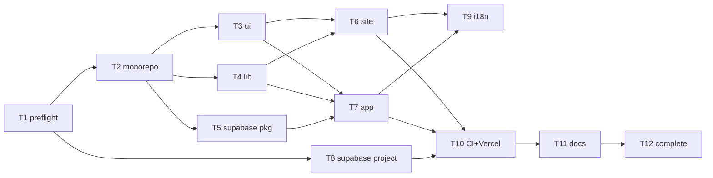

# Spec — Fase 0: Setup do Monorepo Dojô Família Scholze

## Problema

Hoje o repo `dojo-familia-scholze/` tem **zero código** — apenas docs (CLAUDE.md desatualizado citando React Native + Expo + 10 commits de mapeamento). O documento mestre `ARQUITETURA-MESTRE.md` (DRAFT v1.0, 506 linhas, aprovado conceitualmente em 2026-05-25) decidiu PWA universal (Vite + Next.js + Supabase + Asaas) e descreve a Fase 0 na seção 11 como pré-condição pra Sprint 1.

**Evidência concreta da necessidade:**
- `ls Repositorios/dojo-familia-scholze/` retorna apenas `CLAUDE.md _negocio contextos logs`
- Nenhum `package.json`, nenhum `apps/`, nenhum `packages/`, nenhuma `migration` Supabase
- `CLAUDE.md` do dojo (linhas 57-67) ainda declara stack React Native + Expo, conflitando com decisão pós-2026-05-25
- 5 decisões abertas na seção 7 do ARQUITETURA-MESTRE (mas só "Caderno do Sensei" naming bloqueia código — já resolvido)
- Davi está em bootstrap radical (memória crítica `feedback_realidade_financeira_davi.md`): cada hora livre da CLT (08-16) precisa render — sem fundação verificada, Sprint 1 vai misturar "setup infra" com "feature auth" e violar regra-base 7 (commit a cada passo).

**Dor real:** sem Fase 0 isolada, qualquer próxima sessão começa improvisando "vou criar package.json…" e perde 1-2h em decisões já tomadas no doc mestre. Pior: rastreabilidade do progresso fica ruim porque commits misturam "scaffold inicial" + "primeira feature".

## Hipótese central

**Se** entregarmos a Fase 0 como passo isolado com Evidence Bloc (monorepo buildando + Supabase project + identidade visual aplicada + deploy preview Vercel verde + CI rodando), **então** a Sprint 1 começa com tempo 100% gasto em feature (auth multi-perfil + cadastro dojo + turmas + alunos) em vez de mistura infra+feature, **e** Davi consegue cumprir a meta MVP de 4 sprints × 4 semanas dentro das horas livres da CLT.

**Verificável por:** comparar commits do Sprint 1 — se ≥80% das mensagens de commit no Sprint 1 forem `feat(auth)`, `feat(alunos)`, `feat(dojos)` (não `chore(setup)`, `build(deps)`, `infra(supabase)`), a hipótese se confirma.

## Escopo

### Dentro (Fase 0)

**Estrutura monorepo:**
- `package.json` raiz com npm workspaces (`apps/*`, `packages/*`)
- `apps/site/` — Next.js 15 + App Router + TypeScript (landing minimal renderizando logo do pai)
- `apps/app/` — Vite 6 + React 19 + TypeScript + React Router + vite-plugin-pwa (home minimal renderizando logo do pai)
- `packages/ui/` — shadcn/ui base + Tailwind v3 config compartilhada + design tokens (`theme.ts`) com paleta OKLCH derivada dos hex confirmados (`#000000`, `#D32F2F`, `#FFFFFF`, `#3E3E3E`)
- `packages/lib/` — Zod schemas placeholder (`AlunoSchema`, `DojoSchema` esqueleto) + helpers (date, currency BR, formatters)
- `packages/supabase/` — client config + types generated placeholder + queries/ vazio

**Backend Supabase:**
- Criar 1 project Supabase Free tier (region São Paulo)
- Habilitar Auth com Magic Link + Google OAuth providers
- Schema inicial mínimo: tabelas `dojos`, `profiles` (vazias, só estrutura) + RLS habilitado + policies básicas tenant_isolation
- 1 migration inicial `0001_init_multi_tenant.sql` em `supabase/migrations/`
- Seed vazio (`supabase/seed.sql`)
- `.env.example` com placeholders (URL + anon key) — `.env.local` NÃO commitado

**PWA setup completo (apps/app):**
- `manifest.json` (name "Dojô Família Scholze", short_name "Dojô FS", theme color `#000000`, icons placeholder geradas a partir do logo redondo branco)
- Service Worker via Workbox (vite-plugin-pwa)
- Install prompt component placeholder
- Ícones todas resoluções (192, 256, 384, 512) gerados a partir do logo oficial

**i18n setup:**
- `i18next` + `react-i18next` configurado em apps/app + apps/site
- 2 locales: `pt-BR` (default) + `en`
- Strings placeholder mínimas (só "Bem-vindo Sensei", "Dojô Família Scholze", "Ceder para Vencer")

**Identidade visual aplicada:**
- Logos oficiais copiados pra `apps/site/public/` e `apps/app/public/`
- Tokens Tailwind compartilhados refletindo paleta confirmada (preto puro, vermelho-sangue, branco, cinza-grafite)
- Header de ambos apps renderizando logo retangular preto + slogan "CEDER PARA VENCER"

**Deploy + CI:**
- 2 projetos Vercel conectados ao repo (preview por PR + production em main)
- `apps/site` em `dojofs-site-preview.vercel.app` (até decidir domínio)
- `apps/app` em `dojofs-app-preview.vercel.app`
- GitHub Action `.github/workflows/ci.yml`: build + typecheck em PR (matrix: site + app)

**Docs:**
- `.gitignore` na raiz (Node + Vite + Next.js + Supabase + IDE + OS)
- `README.md` na raiz com: o que é, como rodar dev local em <5 min, link pro CLAUDE.md
- `CLAUDE.md` do dojo **atualizado** refletindo stack PWA (não RN+Expo)
- `ARQUITETURA-MESTRE.md` marcado: Fase 0 ✅ na seção 11

### Fora (NÃO entra na Fase 0 — fica pra Sprints 1+)

- **Auth UI** (componentes de login Magic Link, OAuth Google, cadastro) → Sprint 1
- **Schema completo de banco** (alunos, turmas, presença, graduação, mensalidade, etc) → Sprint 1-4 conforme tabela MVP
- **Conteúdo do site público** (landing real com seções, blog, depoimentos) → Sprint 4
- **Loja B2C** → Fase 2
- **Asaas integration** → Sprint 3
- **WhatsApp Evolution API** → Sprint 4+
- **Face scan CompreFace** → Fase 3
- **Certificado PDF generator** → Sprint 2
- **Caderno do Guerreiro/Sensei** UIs → Sprint 4
- **Domínio customizado** (`dojofamiliascholze.com.br`) — adiado até 1ª venda do Davi (bootstrap)
- **Vercel Pro upgrade** — adiado até antes da 1ª venda (Hobby cobre Fase 0 + Sprint 1)
- **Supabase Pro upgrade** — só quando DB >400MB ou storage >800MB (rule do MEMORY.md)
- **Apple Dev account** — descartado definitivamente (PWA não publica em stores)
- **i18n strings completas** — só skeleton + 3 strings placeholder
- **Asset SVG vetorial dos logos** — fica em pendência do pai (INDEX.md linha 83), Fase 0 usa PNGs existentes
- **CNPJ MEI KOD.AI** — sugerido na seção 7 do doc mestre mas não bloqueia Fase 0 (vira bloqueio só no Sprint 3 Asaas)

## Contratos (handoff)

### Input (handoff_in)

| Item | Estado |
|---|---|
| `ARQUITETURA-MESTRE.md` v1.0 DRAFT aprovado conceitualmente | ✓ presente em `contextos/mapeamento/` |
| Assets oficiais do pai | ✓ 4 arquivos em `_negocio/identidade/logos-e-marca/oficial/` (logo redondo branco, retangular preto, banner YT, certificado template) |
| Paleta confirmada visualmente | ✓ INDEX.md linha 38-42 (hex aproximados — refinar com colorpicker no execute) |
| Slogan + kanji + modalidades | ✓ "CEDER PARA VENCER" + 柔道/柔術 + Judô/Jiu-Jitsu |
| Conta GitHub `Davi-Scholze` | ✓ autenticada via `gh auth login` (sessão 2026-05-25 C1/C2 resolvidos) |
| Conta Vercel + Supabase | A criar/confirmar no Davi durante /execute |
| Node.js 20+ + npm 10+ | A confirmar via `node -v && npm -v` no `/execute` |
| Repo dojo inicializado + remote configurado | ✓ `git remote -v` → `github.com/Davi-Scholze/dojo-familia-scholze` |

### Output (handoff_out)

| Artefato | Forma de verificação |
|---|---|
| Estrutura monorepo conforme ARQUITETURA-MESTRE §3.1 | `tree -L 3 -I node_modules` mostra apps/site, apps/app, packages/{ui,lib,supabase} |
| Build verde local ambos apps | `npm run build` na raiz finaliza com exit 0 |
| TypeCheck verde ambos apps | `npm run typecheck` exit 0 |
| Lint verde ambos apps | `npm run lint` exit 0 (ESLint config compartilhada via packages/ui ou raiz) |
| 2 URLs Vercel preview ativas | curl 200 OK em ambas URLs |
| Supabase project criado + Magic Link enviável | screenshot do dashboard Supabase + teste manual envio email |
| RLS habilitado em `dojos` + `profiles` | `SELECT * FROM pg_policies WHERE schemaname='public'` retorna ≥2 policies |
| PWA manifest válido | Lighthouse PWA score ≥80 em apps/app |
| Identidade visual visível | screenshot home de ambos apps mostrando logo retangular preto + paleta |
| CI rodando em PR | `.github/workflows/ci.yml` existe + 1 PR de teste com check verde |
| CLAUDE.md do dojo atualizado | grep -L "React Native" CLAUDE.md retorna o arquivo (não match) |
| ARQUITETURA-MESTRE seção 11 atualizado | linha 502 muda de ⏳ pra ✅ |
| Evidence Bloc na PR de fechamento | comando rodado + output literal + critério + resultado conforme regra-base 11 |

### Quality Gates

```yaml
quality_gates:
  - "git status retorna clean após commits + push"
  - "Todos os comandos de output_verification rodam sem erro humano"
  - "Lighthouse PWA score apps/app ≥80 (mobile + desktop)"
  - "≥5 commits atômicos seguindo regra-base 7 (1 step da skill /execute = 1 commit)"
  - "Conventional Commits em PT-BR (tipo(escopo): descrição)"
  - "Nenhum .env, .env.local, credencial, ou anon key commitada (check via grep -r 'SUPABASE_' . | grep -v .env.example)"
  - ".gitignore cobre node_modules, dist, .next, .turbo, .env*, .vercel, coverage"
  - "Evidence Bloc presente na PR de fechamento (regra-base 11)"
```

## Riscos + mitigações

| Risco | Probabilidade | Impacto | Mitigação |
|---|---|---|---|
| Conflito de versões React 19 / Next 15 / Vite 6 entre workspaces | M | M | Pin de versões via `packageManager` no package.json raiz + mesma major React em todos workspaces; testar `npm install` antes de qualquer feature |
| Tailwind config compartilhada não propaga entre apps | M | L | `packages/ui/tailwind.config.shared.ts` exporta config base; cada app faz `extend` em config local; validar via screenshot home dos 2 apps após scaffold |
| Hex da paleta confirmada (INDEX.md aproximados) não bate com logo real | L | M | Usar colorpicker no PNG oficial antes de configurar tokens; Davi valida no preview Vercel |
| Supabase Free tier insuficiente já no MVP | L | M | Trigger Pro documentado em ARQUITETURA-MESTRE §8 (>400MB DB ou >800MB storage); Free cobre Fase 0 + Sprint 1-2 sem dúvida |
| Vercel Hobby não suporta features futuras (Edge cron) | L | L | Hobby cobre Fase 0 + Sprint 1-3; trigger Pro antes Sprint 3 Asaas |
| PWA iOS Safari quirks (push notification 16.4+) | M | L | Documentado em ARQUITETURA-MESTRE §3.4 + §9.6 — não bloqueia Fase 0 (push só na Sprint 4) |
| Davi trava em naming de pacote (`@dojo/ui`, `@dojofs/ui`, sem prefix?) | M | L | Default `@dojo-fs/ui`, `@dojo-fs/lib`, `@dojo-fs/supabase` no monorepo; reverter trivial; decidir no /plan |
| GitHub Action falha por falta de secrets (Supabase URL/key em build) | M | M | CI Fase 0 só faz build + typecheck (não precisa secrets); secrets Vercel runtime entram quando Sprint 1 começa |
| Davi sem Node 20+ instalado localmente | L | H | Primeiro passo do /execute = verificar `node -v` + orientar nvm install se necessário |
| Hook KOD.AI `pre-commit-guard.js` bloqueia commit por engano | L | M | Hook intercepta `> .gitignore` e SQL DDL — esta spec cria .gitignore via `Write` (não redirect) e tem 1 migration SQL com aprovação humana (DDL exige aprovação — regra `.claude/rules/sql-migrations.md`) |
| Conflict entre KOD.AI `/spec` + comando `/spec` do user-global pasta-mãe | L | L | Já resolvido em 2026-05-25 sessão massiva (6 commands SDD delegate criados); skill rodou normalmente |

## Alternativas consideradas

| Alternativa | Por quê descartei |
|---|---|
| **3 repos separados (site / app / shared)** sem monorepo | Sincronizar types + design tokens vira caos manual; PR cruzado em 2-3 repos por feature; rejeitado em ARQUITETURA-MESTRE §3.1. Single repo + workspaces simplifica DX do Davi solo. |
| **Turborepo em vez de npm workspaces** | Overhead pra MVP solo dev; npm workspaces resolvem caching local nativamente em Node 20+; migrar pra Turbo é trivial quando build time virar gargalo (depois de Sprint 2+) |
| **Nx em vez de npm workspaces** | Lock-in maior, aprendizado pesado, mesma desvantagem do Turbo descartado, e Nx força estrutura opinada que conflita com layout já aprovado no ARQUITETURA-MESTRE |
| **Next.js single-app (sem apps/app Vite separado)** | Bundles maiores em rota autenticada (PWA + SSR + RSC); PWA setup mais complexo via Next.js plugin que via vite-plugin-pwa; perde flexibilidade SPA pura na área autenticada; e duplica risco de regressão SEO no site marketing por mudança no app |
| **Vite SSR também pro site (sem Next.js)** | Vite SSR menos maduro 2026 que App Router pra landing + blog + SEO + Open Graph; Vercel é Next.js-native; reverte vantagem zero-config |
| **Remix em vez de Next.js pro site** | Next.js + App Router está mais battle-tested 2026, ecossistema maior, Vercel-native sem ajustes. Remix tem vantagens mas não pra landing simples + loja futura |
| **React Native + Expo (decisão original CLAUDE.md dojo)** | Reverted formalmente em 2026-05-25 — PWA universal cobre mobile + desktop sem Apple Dev ($99/ano) + sem review delays + atualiza silenciosamente. Bootstrap radical do Davi favorece PWA. RN só faria sentido se features nativas críticas (Bluetooth, Notificações iOS sem PWA install) aparecessem — não é caso. |
| **Iniciar direto pela Sprint 1 (auth + cadastro) sem Fase 0 formal** | Mistura "setup infra" com "feature" no mesmo PR, viola regra-base 7 (commit a cada passo), dificulta debug se algo der errado no scaffold, e fere SDD: spec por feature implica fundação separada |
| **Fase 0 sem Supabase project criado (só local)** | Cria gap entre dev local e deploy real; primeiro deploy Sprint 1 vai descobrir setup faltando; melhor descobrir no escopo isolado da Fase 0 |
| **Pular CI GitHub Actions na Fase 0** | Sem CI desde início, Sprint 1 quebra build silenciosamente e Davi só descobre no deploy. 5min de yaml previne horas de debug. |
| **Domínio customizado já na Fase 0** | Viola bootstrap radical — R$ 40-200/ano sem 1ª venda. Subdomain Vercel atende perfeitamente até primeiro fechamento. Reverso trivial. |

## Critérios de aceitação

Mensuráveis e verificáveis por comando ou screenshot:

- [ ] `ls Repositorios/dojo-familia-scholze/` retorna ≥ `apps/ packages/ supabase/ docs/ package.json .gitignore README.md CLAUDE.md _negocio/ contextos/`
- [ ] `node -v` ≥ v20.0.0 confirmado
- [ ] `npm install` na raiz finaliza com exit 0 e gera `node_modules/` (gitignored)
- [ ] `npm run dev --workspace=apps/site` abre Next.js em `http://localhost:3000` renderizando logo retangular preto + slogan
- [ ] `npm run dev --workspace=apps/app` abre Vite em `http://localhost:5173` renderizando logo retangular preto + slogan + "Bem-vindo Sensei" (placeholder, sem auth)
- [ ] `npm run build` na raiz finaliza com exit 0 (ambos workspaces)
- [ ] `npm run typecheck` na raiz finaliza com exit 0
- [ ] `npm run lint` na raiz finaliza com exit 0
- [ ] Lighthouse PWA score em `apps/app` build ≥ 80 (mobile + desktop)
- [ ] Lighthouse SEO score em `apps/site` build ≥ 90 (mobile + desktop)
- [ ] 1 PR aberto + CI verde + 2 URLs Vercel preview acessíveis retornando 200 OK
- [ ] Supabase project criado, region São Paulo, `URL + anon key` em `.env.local` (NÃO commitado — checar via `git ls-files .env.local` retorna vazio)
- [ ] Supabase Auth Magic Link configurado (teste manual: enviar email pra `scholzecr@gmail.com` chega na inbox em <60s)
- [ ] Supabase tabelas `dojos` + `profiles` criadas via migration `0001_init_multi_tenant.sql` + RLS habilitado + ≥2 policies tenant_isolation
- [ ] `CLAUDE.md` do dojo atualizado — `grep "React Native" Repositorios/dojo-familia-scholze/CLAUDE.md` retorna vazio
- [ ] `ARQUITETURA-MESTRE.md` seção 11 linha 502: `✅ Documento mestre criado` + `✅ Scaffold monorepo (Fase 0)` marcados
- [ ] Git history com ≥ 5 commits atômicos seguindo Conventional Commits PT-BR (ex: `chore(monorepo): inicializa workspaces`, `feat(packages/ui): tokens identidade visual`, `feat(supabase): schema inicial multi-tenant`, `feat(apps/app): PWA setup vite-plugin-pwa`, `feat(apps/site): landing minimal Next.js`)
- [ ] Evidence Bloc da Fase 0 escrito ao final do `/complete` com timestamp + comando rodado + output literal + critério + resultado (regra-base 11 KOD.AI)

## Tasks

> Decomposição em 12 tasks atômicas (regra-base 7: 1 task = 1 commit ideal). DAG com paralelismo declarado após T2. Soma estimada: **~9h30min** trabalho focado (Davi solo, 2-3 sessões noturnas).

### DAG resumido

```
T1 (preflight)
├── T2 (monorepo init) ─┬─ T3 (ui)  ─┐
│                       ├─ T4 (lib) ─┼─ T6 (site) ─┐
│                       └─ T5 (sb)  ─┴─ T7 (app)  ─┼─ T9 (i18n) ─┐
│                                                  │             ├─ T11 (docs) ─ T12 (complete)
│                                                  └─ T10 (CI)  ─┘
└── T8 (supabase project) ──────────────────────────────────────┘ (paralelo a T2-T7)
```

### T1 — Pré-flight ambiente local

- **Tipo:** setup
- **Depende de:** _(nenhuma)_
- **Estimativa:** 15min
- **Critério de done:**
  - [ ] `node -v` ≥ v20.0.0
  - [ ] `npm -v` ≥ v10.0.0
  - [ ] `gh auth status` mostra `Davi-Scholze (keyring)` válido
  - [ ] `git -C Repositorios/dojo-familia-scholze status` retorna clean (sem arquivos pendentes)
  - [ ] Workaround env var fantasma documentado: `GITHUB_TOKEN= git ...` quando push for necessário nesta sessão
- **Commit alvo:** _(sem commit — só verificação)_
- **Notas:** Se Node <20, orientar `nvm install 20 && nvm use 20`. Se gh auth falhar, abortar Fase 0 e resolver auth antes.

### T2 — Inicializar monorepo npm workspaces + .gitignore

- **Tipo:** setup
- **Depende de:** T1
- **Estimativa:** 30min
- **Critério de done:**
  - [ ] `package.json` raiz declara `"workspaces": ["apps/*", "packages/*"]` + `"packageManager": "npm@10.x"`
  - [ ] `.gitignore` cobre: `node_modules/`, `dist/`, `.next/`, `.turbo/`, `.env*` (exceto `.env.example`), `.vercel/`, `coverage/`, `.DS_Store`, `Thumbs.db`, `*.log`, `.idea/`, `.vscode/` (parcial)
  - [ ] `npm install` na raiz exit 0
  - [ ] Hook `gitignore-aditivo.md` respeitado (criar via `Write`, não redirect)
- **Commit alvo:** `chore(monorepo): inicializa npm workspaces + .gitignore`

### T3 — Scaffold packages/ui (Tailwind + shadcn/ui + design tokens)

- **Tipo:** feature
- **Depende de:** T2
- **Estimativa:** 1h
- **Critério de done:**
  - [ ] `packages/ui/package.json` com nome `@dojo-fs/ui`
  - [ ] `tailwind.config.shared.ts` exportando config base (paleta + tipografia + container)
  - [ ] `theme.ts` com tokens OKLCH derivados via colorpicker do logo oficial (preto puro `#000000`, vermelho-sangue `#D32F2F` aprox., branco `#FFFFFF`, cinza-grafite `#3E3E3E`)
  - [ ] `components.json` shadcn/ui configurado
  - [ ] 3 componentes base copiados: Button, Card, Input
  - [ ] Slogan e kanji declarados em `constants.ts` (`"CEDER PARA VENCER"`, `"柔道 柔術"`)
- **Commit alvo:** `feat(packages/ui): tokens identidade visual + tailwind shared config`

### T4 — Scaffold packages/lib (Zod schemas + helpers BR)

- **Tipo:** feature
- **Depende de:** T2
- **Estimativa:** 30min
- **Critério de done:**
  - [ ] `packages/lib/package.json` com nome `@dojo-fs/lib`
  - [ ] `schemas/dojo.ts` (`DojoSchema` zod skeleton)
  - [ ] `schemas/aluno.ts` (`AlunoSchema` zod skeleton com `nome`, `data_nascimento`, `dojo_id`, `responsavel_ids`)
  - [ ] `helpers/date-br.ts` (formatação `DD/MM/YYYY`)
  - [ ] `helpers/currency-brl.ts` (formatação `R$ 1.234,56`)
  - [ ] Type exports gerados via `z.infer<typeof Schema>`
- **Commit alvo:** `feat(packages/lib): schemas zod + helpers BR (data + moeda)`

### T5 — Scaffold packages/supabase (client + types placeholder)

- **Tipo:** feature
- **Depende de:** T2
- **Estimativa:** 30min
- **Critério de done:**
  - [ ] `packages/supabase/package.json` com nome `@dojo-fs/supabase`
  - [ ] `client.ts` exportando `createClient(url, anonKey)` via `@supabase/supabase-js`
  - [ ] `types.ts` placeholder (rodará `supabase gen types` em T8)
  - [ ] `queries/` vazio
  - [ ] `.env.example` na raiz do package com `SUPABASE_URL=` + `SUPABASE_ANON_KEY=` (placeholders)
- **Commit alvo:** `feat(packages/supabase): client placeholder + types skeleton`

### T6 — Scaffold apps/site (Next.js 15 landing minimal)

- **Tipo:** feature
- **Depende de:** T3, T4
- **Estimativa:** 1h30min
- **Critério de done:**
  - [ ] `apps/site/package.json` com nome `@dojo-fs/site` + scripts `dev`/`build`/`start`/`typecheck`/`lint`
  - [ ] Next.js 15 + App Router + TypeScript + Tailwind extend via `@dojo-fs/ui`
  - [ ] `app/layout.tsx` + `app/page.tsx` renderizando logo retangular preto + slogan "CEDER PARA VENCER" + kanji
  - [ ] Logo oficial copiado pra `public/logo-retangular-preto.png` + `public/logo-redondo-branco.png`
  - [ ] Open Graph: `<meta>` title "Dojô Família Scholze" + description + `og-image` (banner YT como base inicial)
  - [ ] `npm run dev --workspace=apps/site` abre `http://localhost:3000` rendering OK
  - [ ] `npm run build --workspace=apps/site` exit 0
- **Commit alvo:** `feat(apps/site): landing minimal Next.js 15 com identidade aplicada`

### T7 — Scaffold apps/app (Vite + React 19 PWA setup completo)

- **Tipo:** feature
- **Depende de:** T3, T4, T5
- **Estimativa:** 2h
- **Critério de done:**
  - [ ] `apps/app/package.json` com nome `@dojo-fs/app` + scripts `dev`/`build`/`preview`/`typecheck`/`lint`
  - [ ] Vite 6 + React 19 + TS + React Router v6 + vite-plugin-pwa
  - [ ] `public/manifest.json` (name "Dojô Família Scholze", short "Dojô FS", theme `#000000`, background `#000000`, display `standalone`)
  - [ ] Service Worker via Workbox (vite-plugin-pwa registerType `autoUpdate`)
  - [ ] Ícones PWA gerados a partir do logo redondo branco: 192x192, 256x256, 384x384, 512x512 + maskable
  - [ ] Install prompt component placeholder (botão visível, lógica de detection)
  - [ ] Home `/` renderizando logo + slogan + texto "Bem-vindo Sensei" (placeholder pré-auth)
  - [ ] `npm run dev --workspace=apps/app` abre `http://localhost:5173`
  - [ ] `npm run build --workspace=apps/app` exit 0
  - [ ] Lighthouse PWA score ≥ 80 no build (medido via `npx lighthouse http://localhost:4173 --only-categories=pwa`)
- **Commit alvo:** `feat(apps/app): PWA setup Vite + manifest + service worker + identidade`

### T8 — Setup Supabase project + migration multi-tenant

- **Tipo:** infra
- **Depende de:** T1 (paralelo a T2-T7)
- **Estimativa:** 1h
- **Critério de done:**
  - [ ] 1 Supabase project criado em **region São Paulo** (Free tier)
  - [ ] Auth providers ativados: Magic Link (email OTP) + Google OAuth
  - [ ] Estrutura `supabase/` na raiz monorepo: `migrations/`, `seed.sql` (vazio), `config.toml`
  - [ ] Migration `supabase/migrations/0001_init_multi_tenant.sql` aplicada com:
    - tabela `dojos` (id uuid PK, nome text, slug text unique, created_at)
    - tabela `profiles` (id uuid PK = auth.users.id, dojo_id uuid FK, role text check, full_name)
    - RLS habilitado em ambas
    - policy `tenant_isolation` em `profiles` (user só vê próprio profile + colegas mesmo dojo)
    - policy `dojos_select_own` (user só vê seu dojo)
  - [ ] `.env.local` na raiz do monorepo com `SUPABASE_URL` + `SUPABASE_ANON_KEY` (NÃO commitado — verificar `git ls-files .env.local` vazio)
  - [ ] Teste manual Magic Link: enviar pra `scholzecr@gmail.com`, email chega em <60s
  - [ ] **Aprovação humana explícita do Davi antes de aplicar a migration** (regra `.claude/rules/sql-migrations.md`)
- **Commit alvo:** `feat(supabase): schema inicial multi-tenant + RLS policies`
- **Notas:** Davi cria o project no dashboard (precisa login Supabase). Eu gero o SQL + .env.example. Davi roda `supabase db push` quando confirmar.

### T9 — Setup i18n (i18next pt-BR + en com strings placeholder)

- **Tipo:** feature
- **Depende de:** T6, T7
- **Estimativa:** 30min
- **Critério de done:**
  - [ ] `i18next` + `react-i18next` instalados em ambos apps
  - [ ] `locales/pt-BR.json` + `locales/en.json` em cada app com 3 strings: `welcome_sensei`, `org_name`, `slogan`
  - [ ] Default locale: `pt-BR`
  - [ ] Switch idioma funcional (botão dummy no header de ambos apps)
  - [ ] Build typecheck ambos apps verde após integração
- **Commit alvo:** `feat(i18n): setup i18next pt-BR + en com 3 strings placeholder`

### T10 — CI GitHub Actions + Vercel deploy preview

- **Tipo:** infra
- **Depende de:** T6, T7
- **Estimativa:** 1h
- **Critério de done:**
  - [ ] `.github/workflows/ci.yml` com matrix `[apps/site, apps/app]` rodando `npm ci` + `npm run typecheck` + `npm run build` + `npm run lint`
  - [ ] CI dispara em pull_request pra `master`
  - [ ] 2 projetos Vercel conectados ao repo `Davi-Scholze/dojo-familia-scholze`:
    - `dojofs-site` (root: `apps/site`, framework: Next.js)
    - `dojofs-app` (root: `apps/app`, framework: Vite)
  - [ ] Preview deploy automático por PR ativado em ambos
  - [ ] 1 PR de teste aberto → CI verde → 2 URLs Vercel preview retornam 200 OK + renderizam logo
- **Commit alvo:** `ci(github-actions): build + typecheck matrix em PR + Vercel preview deploy`
- **Notas:** Davi precisa conectar repo manualmente no dashboard Vercel (login + import). Eu gero o `vercel.json` se aplicável + workflow yml.

### T11 — Sincronizar CLAUDE.md + README.md + ARQUITETURA-MESTRE seção 11

- **Tipo:** docs
- **Depende de:** T10
- **Estimativa:** 30min
- **Critério de done:**
  - [ ] `Repositorios/dojo-familia-scholze/CLAUDE.md` reescrito refletindo stack PWA (não mais RN+Expo). `grep "React Native" CLAUDE.md` retorna vazio. Ordem de leitura atualizada apontando pra ARQUITETURA-MESTRE.
  - [ ] `Repositorios/dojo-familia-scholze/README.md` criado/atualizado com: o que é o projeto, como rodar dev local em <5min (`npm install && npm run dev --workspace=apps/app`), link pra CLAUDE.md + ARQUITETURA-MESTRE, status DRAFT
  - [ ] `contextos/mapeamento/ARQUITETURA-MESTRE.md` seção 11 linhas 501-504: marcas `⏳` viram `✅` para "Documento mestre", "5 itens críticos decididos", "Supabase project + .env.local", "Scaffold monorepo"
- **Commit alvo:** `docs(dojo): sincroniza CLAUDE + README + ARQUITETURA-MESTRE pós Fase 0`

### T12 — /complete Fase 0 com Evidence Bloc

- **Tipo:** docs
- **Depende de:** T11
- **Estimativa:** 15min
- **Critério de done:**
  - [ ] Skill `/complete` rodada sobre esta spec
  - [ ] Evidence Bloc persistido no final desta spec (`docs/decisoes/2026-05-25_fase-0-setup-dojo-scaffold.md`) contendo: timestamp UTC, comando rodado por critério de aceitação, output literal, critério de sucesso, resultado (PASS/FAIL)
  - [ ] Status da spec muda `em-andamento` → `implementado`
  - [ ] Memória persistente `project_dojo.md` atualizada (E14 ✅ implementada + Fase 0 done + próximo Sprint 1)
  - [ ] PROMPT_MASTER_HANDOFF.md atualizado refletindo Fase 0 done + Sprint 1 começa próxima sessão
  - [ ] Regra-base 11 (Iron Law honestidade) respeitada — sem claim de "complete" sem Evidence Bloc adjacente
- **Commit alvo:** `complete(dojo): Evidence Bloc Fase 0 setup monorepo scaffold`

---

## Plano

> Plano executável. **Executor:** IA solo (Claude Code) + Davi (manuais T1, T8 dashboard, T10 Vercel connect, aprovações). **Multi-agente descartado** — 12 tasks não justificam overhead de coordenação + risco de race; sequência ordenada com checkpoints visuais é mais previsível pro Davi solo em bootstrap radical.

### Sequência (DAG topological + override pra T8 paralelo)



### Execução em fases

| Fase | Tasks | Executor | Duração | Checkpoint após? |
|---|---|---|---|---|
| **F0 — Preflight** | T1 | Davi (manual) + IA verificar | 15min | ✓ Reportar versões Node/npm/gh; bloquear se algo abaixo do mínimo |
| **F1 — Fundação** | T2 | IA solo | 30min | ✓ Confirmar `npm install` exit 0 antes de espalhar |
| **F2 — Packages** | T3 → T4 → T5 (sequencial IA) | IA solo | 2h (1h + 30min + 30min) | ✓ Após T5: 3 packages buildam isolados |
| **F2 paralelo** | T8 (Supabase project + migration) | Davi (dashboard) + IA (SQL) — começa em paralelo a F1/F2 | 1h | ✓ **Davi aprova SQL DDL antes de aplicar** (regra `.claude/rules/sql-migrations.md`); teste Magic Link enviado |
| **F3 — Apps** | T6 → T7 (sequencial IA) | IA solo | 3h30 (1h30 + 2h) | ✓ Após T7: **Lighthouse PWA ≥80** medido + screenshot Davi valida identidade |
| **F4 — Cross-cutting** | T9 (i18n) | IA solo | 30min | _(sem checkpoint — leve)_ |
| **F5 — Deploy + CI** | T10 | Davi (Vercel connect manual) + IA (workflow yml) | 1h | ✓ **PR de teste com CI verde + 2 URLs Vercel 200 OK** |
| **F6 — Sincronia docs** | T11 | IA solo | 30min | _(sem checkpoint — docs)_ |
| **F7 — Fechamento** | T12 (`/complete`) | IA + Davi (revisar Evidence Bloc) | 15min | ✓ **Evidence Bloc completo + memória + handoff atualizados** |

**Total estimado:** ~9h30min (~10h com buffer 5%). Distribuído em **2 sessões noturnas Davi** (~5h cada) OU **3 sessões mais curtas** (~3h30 cada). T8 pode comprimir tempo se Davi conseguir criar Supabase project em paralelo ao F1+F2.

### Checkpoints (pausa visual obrigatória — regra inegociável #2 CLAUDE.md raiz)

| # | Ponto | O que reportar pro Davi | OK do Davi destrava? |
|---|---|---|---|
| CP1 | Pós T1 | Versões reais Node/npm/gh + status repo + workaround env var | T2 |
| CP2 | Pós T2 | `tree` da estrutura + output `npm install` | T3 |
| CP3 | Pós T5 | `npm run build` exit 0 em packages/ui+lib+supabase | T6 |
| CP4 | Pós T7 | Screenshot home apps/app + Lighthouse PWA score literal + paleta visível | T8 (final) OU T9 |
| CP5 | Pós T8 | SQL DDL completo pra aprovação + após aplicar: prova RLS via `SELECT pg_policies` | (Davi aprova antes de `supabase db push`) |
| CP6 | Pós T10 | URL do PR + CI status verde + 2 URLs preview Vercel testadas | T11 |
| CP7 | Pós T12 | Evidence Bloc inteiro + memórias atualizadas + handoff sincronizado | Fase 0 fechada |

### Stop-criteria (4 condições de abort)

1. **Task falha 2x consecutivas com mesma causa raiz** → ABORTAR plano + diagnose root cause + replanejar via novo `/spec` ou `/break`. NÃO retry cego.
2. **Lighthouse PWA score em T7 build < 70** → ABORTAR F3, investigar manifest/SW antes de prosseguir. PWA ruim na Fase 0 polui Sprint 1.
3. **Migration T8 quebra teste RLS** (user de dojo A enxerga linha de dojo B) → ROLLBACK migration + criar `0002_fix_rls_<motivo>.sql`. NUNCA mexer em `0001` aplicado.
4. **Davi disser "stop" / "pausa" / "espera"** → pausa imediata, reporta estado exato, aguarda direção.

### Risco residual mapeado da spec (§ Riscos + mitigações)

| Risco da spec | Task que mitiga | Como verifica |
|---|---|---|
| Conflito React 19 / Next 15 / Vite 6 | T2 (`packageManager` pin + `peerDependencies`) | `npm install` exit 0 sem warning de peer |
| Tailwind config não propaga | T3 (`tailwind.config.shared.ts` exporta base) + T6+T7 (extend local) | Screenshot home dos 2 apps com paleta visível |
| Hex paleta não bate com logo | T3 (colorpicker no PNG oficial antes de tokens) | Davi valida no preview Vercel (CP4) |
| Supabase Free insuficiente já no MVP | T8 (apenas documentar trigger Pro — não preempt) | _(monitorar; trigger só vira ação se DB >400MB)_ |
| Vercel Hobby insuficiente | T10 (apenas documentar trigger Pro) | _(monitorar; trigger antes Sprint 3 Asaas)_ |
| PWA iOS Safari quirks | T7 (manifest + SW conservadores) + ARQUITETURA-MESTRE §3.4 já documenta fallback | Lighthouse PWA ≥80 mobile (CP4) |
| Davi trava em naming pacote | T2 (default `@dojo-fs/`) — já decidido | _(sem ação residual)_ |
| GitHub Action sem secrets | T10 (Fase 0 não precisa secrets — só build/typecheck) | CI verde sem env vars (CP6) |
| Davi sem Node 20 | T1 (preflight obrigatório) | T1 critério de done (CP1) |
| Hook KOD.AI bloqueia | T2 (gitignore via `Write` não redirect) + T8 (aprovação humana DDL) | Hook não dispara nas operações planejadas |

### Quem faz o quê (humano × IA explícito)

**Davi (manuais não-delegáveis):**
- T1: rodar `node -v`, `npm -v`, `gh auth status` no terminal dele
- T8 parte 1: criar Supabase project no dashboard (login, region São Paulo) + ativar Auth providers
- T8 parte 3: aprovar SQL DDL antes de IA rodar `supabase db push`
- T8 parte 4: teste manual Magic Link (clica no link no email)
- T10 parte 1: conectar repo a 2 projetos Vercel no dashboard
- Aprovação textual em cada checkpoint CP1-CP7

**IA solo (Claude Code):**
- T2-T7 inteiramente (scaffold packages + apps)
- T8 parte 2: gerar SQL migration `0001_init_multi_tenant.sql` + `.env.example`
- T8 parte 5: teste `SELECT * FROM pg_policies` após Davi aplicar
- T9 inteiramente (i18next setup)
- T10 parte 2: workflow yml + `vercel.json`
- T11 inteiramente (CLAUDE.md + README + ARQUITETURA-MESTRE update)
- T12 parte 1: skill `/complete` + Evidence Bloc draft

---

## Próximo passo

→ `/execute` rodará a Fase 0 conforme este plano, parando em cada checkpoint pra pausa visual + OK explícito do Davi. Estimativa de **1ª sessão executar até CP4** (~5h: F0+F1+F2+F2-paralelo+F3), **2ª sessão concluir** (F4+F5+F6+F7, ~4h30).
