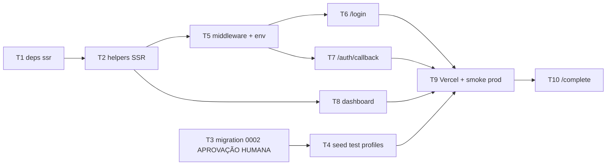

# Spec — Sprint 1a: Auth Magic Link + Dashboard + Seed Test Profiles

## Problema

Fase 0 entregou fundação técnica completa (single-app Next.js + Supabase + RLS multi-tenant + i18n PT/EN + PWA + Vercel CI/CD), mas a rota `/dashboard` é **placeholder público sem auth**. Hoje qualquer pessoa acessa `https://dojofs-davi-scholzes-projects.vercel.app/dashboard` e vê a tela "Bem-vindo Sensei". Sem auth, nenhum trabalho de Sprint 1+ (cadastro de profissionais, alunos, turmas, presença, mensalidades) pode existir — todas dependem de "quem é o user logado" pra aplicar policies RLS corretamente.

**Evidência concreta:**
- `curl https://dojofs-davi-scholzes-projects.vercel.app/dashboard` → HTTP 200 sem auth
- Schema atual `profiles.id` é FK 1:1 com `auth.users(id)` — bloqueia o fluxo Sprint 4 onde **responsável adulto administra profile de menor** (`responsável` NÃO é role, é RELAÇÃO conforme decisão Davi 2026-05-25)
- Davi declarou que ele NUNCA é admin real do dojo do pai — usa perfis fake de teste. Atualmente impossível: não existe seed nem mecanismo de criar test profiles facilmente

**Dor real:** sem auth + sem schema refactor + sem test profiles, próximas 3-4 sub-sprints (1b/1c/Sprint 2) precisam parar a cada feature pra "improvisar login", "fingir que tem user", "ALTER TABLE em produção", multiplicando dor.

## Hipótese central

**Se** implementarmos:
1. Migration 0002 com seed singleton dojo + refactor `profiles.id` → `profiles.owner_user_id` (FK CASCADE)
2. Page `/login` com Magic Link via Supabase Auth (`signInWithOtp`)
3. Route Handler `/auth/callback` que processa redirect Supabase
4. Middleware Next.js fazendo gating `/dashboard` ↔ `/login`
5. Script `seed-test-profiles.mjs` criando 3 test profiles (admin/professor1/professor2) via Auth Admin API
6. Atualização do `/dashboard` pra mostrar `full_name` + role do user logado + botão "Sair"

**Então:**
1. Davi consegue testar fluxos como `admin@test.local` OU `professor1@test.local` OU `professor2@test.local` sem virar admin real
2. Sprint 1b (convite professor real via Server Action + form cadastro detalhado) começa com schema final pronto, sem refactor doloroso
3. Sprint 4 (responsável-administra-menor com LGPD) reusa o mesmo schema sem migração quebrando produção
4. Rota `/dashboard` deixa de ser acessível sem session — fundação canônica L1 instalada

**Verificável por:** em `https://dojofs-davi-scholzes-projects.vercel.app/dashboard` (após deploy desta Sprint 1a), acesso sem cookies → redireciona `/login`. Login com `admin@test.local` → vejo "Bem-vindo, <full_name>" + badge "admin". Logout limpa cookies e redireciona `/login`. Davi alterna entre os 3 test profiles e cada um vê seu próprio dashboard com sua role.

## Escopo

### Dentro

**1. Migration 0002 (`supabase/migrations/0002_owner_user_id_refactor.sql` + rollback adjacente):**
- Singleton seed: `INSERT INTO public.dojos (nome, slug) VALUES ('Dojô Família Scholze', 'dojo-familia-scholze')` (idempotente via `ON CONFLICT DO NOTHING` no `slug`)
- Drop constraint atual `profiles_id_fkey` (FK direta `profiles.id → auth.users.id`)
- Alter `profiles.id` pra ser UUID standalone com `DEFAULT gen_random_uuid()`
- Add column `profiles.owner_user_id uuid NOT NULL REFERENCES auth.users(id) ON DELETE CASCADE`
- Add index `idx_profiles_owner_user_id`
- Atualizar function `current_user_dojo_id()` pra usar `WHERE owner_user_id = auth.uid()`
- Atualizar 3 policies em `profiles`:
  - `profiles_select_same_dojo` → `USING (owner_user_id = auth.uid() OR dojo_id = current_user_dojo_id())`
  - `profiles_insert_self` → `WITH CHECK (owner_user_id = auth.uid())`
  - `profiles_update_self` → `USING (owner_user_id = auth.uid()) WITH CHECK (owner_user_id = auth.uid())`
- Policies em `dojos` permanecem (não tocam `profiles`)
- Validação pós-migration via `scripts/validate-migration.mjs` (extender o checklist existente)

**2. Auth flow (`apps/site/`):**
- `app/login/page.tsx` (Client Component): form com input email + button "Receber link mágico", states (idle/sending/sent/error), i18n via `useTranslation()`
- `app/login/actions.ts` (Server Action): wrapper sobre `supabase.auth.signInWithOtp({ email, options: { emailRedirectTo: <SITE_URL>/auth/callback } })`
- `app/auth/callback/route.ts` (Route Handler GET): captura `code` query param + `searchParams.get('next')` (default `/dashboard`), chama `supabase.auth.exchangeCodeForSession(code)`, faz redirect com cookies de session setados
- `middleware.ts` (na raiz `apps/site/`): usando `@supabase/ssr` createServerClient com cookies handlers:
  - Refresh session em cada request
  - Redirect `/dashboard/*` → `/login?next=<original-path>` se sem session
  - Redirect `/login` → `/dashboard` se já autenticado
  - Public paths não tocadas: `/`, `/auth/callback`, `/manifest.webmanifest`, `/sw.js`, `/_next/*`

**3. Dashboard (atualização de placeholder existente):**
- `app/dashboard/layout.tsx`: agora Server Component que via `createServerClient` carrega user + profile do banco. Passa via context pro children (props ou contexto React)
- `app/dashboard/page.tsx`: substitui "Bem-vindo, Sensei" estático por dinâmico (`Bem-vindo, ${profile.full_name}` + badge role)
- Novo component `apps/site/components/UserBadge.tsx`: mostra nome + role + logout button no header dashboard
- `app/dashboard/actions.ts`: Server Action `signOut()` que chama `supabase.auth.signOut()` + `revalidatePath('/')`

**4. `packages/supabase/` (helpers SSR):**
- `src/server.ts`: factory `createServerClient(cookies)` pra Server Components / Route Handlers / Server Actions
- `src/middleware.ts`: helper `updateSession(request)` pra middleware Next.js
- `src/index.ts`: exportar tudo
- Adicionar dep `@supabase/ssr ^0.5.x`

**5. Script `scripts/seed-test-profiles.mjs`:**
- Via Supabase Management API + Auth Admin API com `SUPABASE_ACCESS_TOKEN`:
- Cria 3 users em `auth.users`:
  - `admin@test.local` (role `admin`) — full_name "Admin Teste"
  - `professor1@test.local` (role `professor`) — full_name "Professor Um (Teste)"
  - `professor2@test.local` (role `professor`) — full_name "Professor Dois (Teste)"
- Pra cada user: cria row em `profiles` com `owner_user_id = user.id`, `dojo_id` = singleton dojo, role + full_name
- Output: lista com email + Magic Link **pré-validado** (URL `?code=<token>` que faz auto-login em dev/preview) — Davi cola no browser pra testar cada role
- Idempotente: se user já existe, skipa

**6. Env vars / config:**
- `.env.local` adiciona `NEXT_PUBLIC_SITE_URL=https://dojofs-davi-scholzes-projects.vercel.app` (pra Magic Link redirectTo funcionar em prod E dev — em dev, override pra `http://localhost:3000`)
- Vercel project: setar `NEXT_PUBLIC_SITE_URL` como env var production
- Supabase dashboard: confirmar `Site URL` aponta pra https://dojofs-davi-scholzes-projects.vercel.app + `Additional Redirect URLs` inclui `http://localhost:3000/auth/callback` + `https://dojofs-davi-scholzes-projects.vercel.app/auth/callback`

**7. Docs sync (final da Sprint 1a):**
- `CLAUDE.md` dojo: adicionar Sprint 1a no histórico
- Memória `project_dojo`: capturar decisões Sprint 1a + 3 test profiles + URL canônica `/login`
- `ARQUITETURA-MESTRE.md` §11: marcar Sprint 1a ✅

### Fora (NÃO entra Sprint 1a)

- **Convite via Server Action** (admin convida professor real via Supabase `auth.admin.inviteUserByEmail` + metadata `role`) → **Sprint 1b**
- **Tela `/dashboard/equipe`** (lista de professores + form convidar) → **Sprint 1b**
- **Form cadastro detalhado professor** (faixa, modalidade, anos_experiencia, foto, federação) → **Sprint 1b** (também adiciona colunas em `profiles` via migration 0003)
- **Tela `/dashboard/alunos`** (CRUD alunos) → **Sprint 1c**
- **Tela `/dashboard/turmas`** (CRUD turmas) → **Sprint 1c**
- **Google OAuth** como alternativa ao Magic Link → **Sprint 2+** (precisa Google Cloud Console setup)
- **Reset de senha / login com senha** → **NUNCA** (Magic Link only é decisão arquitetural)
- **MFA / 2FA** → **Sprint 4+** (junto com LGPD compliance avançada)
- **Edge Functions** (cron alertas, certificate PDF, etc) → **Sprint 2+**
- **Fluxo responsável-administra-menor com LGPD** → **Sprint 4** (mas schema já preparado)
- **service_role key no Vercel** → **Sprint 1b** (necessária pra `inviteUserByEmail` server-side)
- **Internacionalização ES + outras línguas** → **Sprint 4+** (decisões-mvp 2026-05-21 sugere PT+EN+ES; Sprint 1a fica PT+EN do que já tá)
- **Telemetria / analytics** → **Sprint 3+**

## Contratos (handoff)

### Input (handoff_in)

| Item | Estado |
|---|---|
| Fase 0 completa (migration 0001 aplicada, Supabase project `mubcbbrwoeblvqaiebou` ativo) | ✅ Evidence Bloc registrado |
| Singleton dojo NÃO existe ainda na tabela `dojos` (vazia) | ✅ confirmar via `SELECT count(*) FROM dojos` |
| `.env.local` raiz com `SUPABASE_URL`, `NEXT_PUBLIC_SUPABASE_ANON_KEY`, `SUPABASE_ACCESS_TOKEN`, `SUPABASE_PROJECT_REF`, `VERCEL_TOKEN` | ✅ presentes |
| Vercel project `dojofs` deployando OK (auto-deploy push master) | ✅ HTTP 200 em rota canônica |
| `@dojo-fs/supabase` package com factory `createDojoSupabase(url, anonKey)` (browser client) | ✅ Fase 0 |
| CI GitHub Actions verde | ✅ run 26413463584 |
| Schema atual `profiles.id` é FK auth.users (1:1) | ✅ confirmar via `\d public.profiles` |

### Output (handoff_out)

| Artefato | Forma de verificação |
|---|---|
| Migration 0002 aplicada via Management API | scripts/validate-migration.mjs estendido com 4 novos checks (owner_user_id existe + NOT NULL + FK CASCADE; singleton dojo existe; policies usam owner_user_id; index criado) → 10/10 PASS |
| 3 test profiles criados em `auth.users` + `profiles` | `SELECT email, role, full_name FROM profiles p JOIN auth.users u ON u.id = p.owner_user_id` retorna 3 rows |
| `/login` renderiza form com i18n | curl GET `/login` retorna HTML com `<form>` + `email` input + button traduzido |
| `/auth/callback` processa redirect | curl GET `/auth/callback?code=fake-token` retorna 4xx (token inválido) sem crash; com token real, redireciona `/dashboard` |
| Middleware ativo | curl GET `/dashboard` sem cookies redireciona pra `/login` (3xx); curl GET `/login` com cookies de session válidos redireciona pra `/dashboard` |
| `/dashboard` mostra `full_name` + role | manual: Davi acessa com test profile, vê nome correto + badge role |
| Logout funciona | clicar "Sair" → cookies session limpos → redirect `/login` |
| `npm run build` Vercel verde | HTTP 200 em todas rotas `/`, `/login`, `/auth/callback`, `/dashboard`, `/manifest.webmanifest`, `/sw.js` |
| CI verde | GitHub Actions run success |
| Evidence Bloc na spec ao final | Iron Law (regra-base 11) |

### Quality Gates

```yaml
quality_gates:
  - "Migration 0002 aplicada via Management API (NÃO no SQL Editor) com aprovação textual humana antes de POST (.claude/rules/sql-migrations.md)"
  - "Rollback 0002 testado em dry-run antes de aplicar production migration"
  - "Test profiles APENAS em ambiente Supabase atual (não há prod separado ainda — documentado como tech debt)"
  - "Magic Link teste só com permissão textual explícita do Davi (memória feedback_pedir_permissao_acoes_externas ⭐)"
  - "Service_role key NÃO commitada (ainda nem é necessária Sprint 1a — Auth Admin API via PAT Management)"
  - ".env.local NÃO commitada (git check-ignore .env.local retorna vazio)"
  - "typecheck verde 4 workspaces"
  - "build verde Vercel"
  - "CI GitHub Actions verde"
  - "Sem regressão Fase 0: validate-migration.mjs continua 6/6 (+ 4 novos) = 10/10"
  - "Sem warning ESLint novo no build (warning  Fase 0 fica pra Sprint 1c quando re-trabalhar /dashboard)"
  - "Commits atômicos PT-BR (regra-base 7)"
  - "Push imediato pós-cada commit (extensão Davi)"
  - "Evidence Bloc final"
```

## Riscos + mitigações

| Risco | Probabilidade | Impacto | Mitigação |
|---|---|---|---|
| `@supabase/ssr` Next.js 15 + React 19 incompatibilidade | M | H | Verificar versão suportada via `npm info @supabase/ssr peerDependencies` antes; pacote em produção desde 2024; se falhar, fallback `@supabase/auth-helpers-nextjs` (deprecated mas estável) |
| Cookies Supabase session não persistem entre middleware + Server Component | M | H | Usar exatamente o pattern oficial Next.js 15 documentado em supabase.com/docs/guides/auth/server-side/nextjs; helpers em `packages/supabase/src/{server,middleware}.ts` |
| Magic Link redirect URL não bate em prod vs dev | M | M | `NEXT_PUBLIC_SITE_URL` env var configurada nos 2 ambientes; `supabase/config.toml` `additional_redirect_urls` inclui localhost:3000 + Vercel preview |
| Refactor `profiles.id` quebra alguma view/policy/FK que esqueci | M | H | Como dojo está sem dados reais (auth.users vazio após cleanup Magic Link), migration tem zero risco de corromper dados. DDL exige aprovação humana (regra) — apresento SQL completo + 4 dados (O QUE, QUANTO, RISCO, REVERSÃO) |
| Seed test profiles falha por algum check do Supabase (signups disabled, etc) | L | M | Settings do Supabase project já com email enable_signup=true (Fase 0); Auth Admin API bypassa frontend signup flow |
| Test profile pode logar acidentalmente em produção real (mesmo banco) | M | M | Documentar limitação: até Sprint 1c não há separação prod/dev (1 Supabase Free project). Test profiles têm sufixo `@test.local` claramente identificável. Tech debt: criar Supabase project separado pra prod quando 1º cliente real fechar |
| Middleware Next.js infinite redirect loop (login → callback → login) | L | H | Allowlist explícita de paths públicos no matcher do middleware; teste manual antes de deploy |
| Davi sem `NEXT_PUBLIC_SITE_URL` setado em Vercel → Magic Link aponta pra localhost | M | M | Verifico via Vercel API que env var está setada antes de testar prod |

## Alternativas consideradas

| Alternativa | Por quê descartei |
|---|---|
| **Email + senha clássico** | Mais código (hashing, reset, brute force protection, validação complexa), pior UX (user esquece senha), bootstrap-mode favorece simplicidade. Magic Link é one-tap e zero estado |
| **Google OAuth ONLY** | Nem todos profs/alunos têm conta Google (alunos crianças, idosos, ambiente pessoal vs profissional). Magic Link é universal — qualquer email funciona |
| **Auth0 / Clerk / Supertokens (terceiros pagos)** | Custo (Clerk $25/mo após free tier) + lock-in. Supabase Auth incluso no Free tier, integrado nativamente com RLS Postgres (zero JOIN extra) |
| **Auth caseiro (JWT manual + bcrypt)** | Time-to-market terrível em bootstrap; risco de segurança alto; reinventa roda. Supabase Auth é battle-tested |
| **Profile mantém `id = auth.uid()` (sem `owner_user_id`)** | Bloqueia fluxo Sprint 4 responsável-administra-menor (Davi confirmou hoje que responsável NÃO é role separada, é RELAÇÃO administra). Refactor agora (banco vazio) é trivial; refactor depois com dados reais de cliente é caro |
| **Tabela `convites` separada (não usar Supabase Auth nativo)** | Davi escolheu explicitamente "Supabase Auth nativo + metadata role" como melhor opção (3 perguntas pré-spec) |
| **Seed via SQL INSERT direto em `auth.users`** | Quebra na prática — `auth.users` é gerenciado pelo GoTrue + triggers, INSERT direto não cria identities. Usar Auth Admin API é o caminho canônico |
| **Login só funciona em prod (sem ambiente dev)** | Davi desenvolve nas horas livres, precisa testar local antes de cada push. Setup local com env vars de dev é mandatório |
| **Bootstrap admin: primeiro user vira admin automático via trigger** | Davi explicitamente disse "não, definimos depois" — quem é admin real fica pra decisão informada quando entender modelo de uso do pai |

## Critérios de aceitação

Mensuráveis e verificáveis por comando ou observação:

- [ ] Migration 0002 aplicada via `POST /v1/projects/{ref}/database/query` (Management API), **com aprovação textual humana antes** (regra `.claude/rules/sql-migrations.md`)
- [ ] `scripts/validate-migration.mjs` retorna **10/10 PASS** (6 existentes Fase 0 + 4 novos: `owner_user_id` existe + NOT NULL + FK CASCADE; singleton dojo `slug='dojo-familia-scholze'` count=1; policies usam `owner_user_id`; index `idx_profiles_owner_user_id` existe)
- [ ] `SELECT count(*) FROM public.dojos WHERE slug='dojo-familia-scholze'` retorna **1** (singleton)
- [ ] `SELECT count(*) FROM public.profiles WHERE owner_user_id IS NOT NULL` retorna **3** (test profiles após seed)
- [ ] `SELECT role, full_name FROM profiles ORDER BY role` retorna 3 rows com roles `admin`, `professor`, `professor` e full_names `Admin Teste`, `Professor Um (Teste)`, `Professor Dois (Teste)`
- [ ] `npm run typecheck` exit 0 nos 4 workspaces
- [ ] `npm run build --workspace=apps/site` exit 0 + nova rota `/login` listada na tabela de routes
- [ ] `scripts/seed-test-profiles.mjs` executa idempotente (rodar 2x sem erro, não duplica profiles)
- [ ] `curl -i https://dojofs-davi-scholzes-projects.vercel.app/dashboard` retorna `3xx Location: /login*` (sem cookies de session)
- [ ] `curl -i https://dojofs-davi-scholzes-projects.vercel.app/login` (sem cookies) retorna `200 OK` com HTML do form (input email + button)
- [ ] Davi testa manualmente cada test profile via Magic Link colado, **com permissão prévia textual** pra envio
- [ ] `/dashboard` mostra "Bem-vindo, Admin Teste" + badge "admin" quando logado como `admin@test.local`
- [ ] Botão "Sair" no `/dashboard` limpa cookies + redireciona `/login`
- [ ] Acessar `/login` enquanto logado redireciona pra `/dashboard` (sem loop)
- [ ] CI GitHub Actions run **success** após último push
- [ ] Vercel preview deploy verde, URL acessível
- [ ] `git ls-files .env.local` retorna **vazio** (gitignored)
- [ ] Memória `project_dojo` atualizada com Sprint 1a + 3 test profiles + URL `/login`
- [ ] `ARQUITETURA-MESTRE.md` §11 marca Sprint 1a ✅
- [ ] Evidence Bloc adicionado a esta spec ao final do `/complete`

## Tasks

> Decomposição em 10 tasks atômicas (regra-base 7). DAG com paralelismo declarado.
> Soma estimada: **~6h15** trabalho focado (cabe em 1-2 sessões noturnas Davi).

### DAG

```
T1 (deps @supabase/ssr) → T2 (helpers SSR) ─┬─→ T5 (middleware + env) ─┬─→ T6 (/login) ─┐
                                            │                           ├─→ T7 (/auth/callback) ─┼─→ T9 (Vercel + smoke prod) → T10 (/complete)
                                            └──→ T8 (dashboard logado) ──────────────────────────┘
                                                          ↑
T3 (migration 0002 — aprovação humana) → T4 (seed test profiles) ──────┘
[paralelo a T1+T2]
```

### T1 — Adicionar dependência `@supabase/ssr`

- **Tipo:** setup
- **Depende de:** _(nenhuma)_
- **Estimativa:** 10min
- **Critério de done:**
  - [ ] `apps/site/package.json` ganha `"@supabase/ssr": "^0.5.x"` em deps
  - [ ] `packages/supabase/package.json` ganha `@supabase/ssr` em `peerDependencies`
  - [ ] `npm install` exit 0, sem high vulnerabilities novas
  - [ ] `npm run typecheck` continua exit 0
- **Commit alvo:** `chore(deps): adiciona @supabase/ssr pra auth Next.js SSR`

### T2 — Helpers SSR em `packages/supabase`

- **Tipo:** feature
- **Depende de:** T1
- **Estimativa:** 30-45min
- **Critério de done:**
  - [ ] `packages/supabase/src/server.ts` — `createServerClient(cookies)` factory pra Server Components + Route Handlers + Server Actions
  - [ ] `packages/supabase/src/middleware.ts` — `updateSession(request)` helper que refresca cookies session
  - [ ] `packages/supabase/src/index.ts` exporta `createServerClient`, `updateSession`
  - [ ] `packages/supabase/package.json` `exports` field ganha `./server` e `./middleware`
  - [ ] `npm run typecheck --workspace=packages/supabase` exit 0
- **Commit alvo:** `feat(packages/supabase): adiciona helpers SSR (createServerClient + updateSession)`

### T3 — Migration 0002 (refactor profiles + singleton dojo) — **APROVAÇÃO HUMANA**

- **Tipo:** infra
- **Depende de:** _(nenhuma — paralelo a T1+T2)_
- **Estimativa:** 45min (gerar SQL + apresentar 4 dados + Davi aprovar textualmente + aplicar via Management API + validar)
- **Critério de done:**
  - [ ] `supabase/migrations/0002_owner_user_id_refactor.sql` criado com: INSERT singleton dojo (idempotente `ON CONFLICT DO NOTHING`) + DROP constraint `profiles_id_fkey` + ALTER `profiles.id` pra UUID standalone com `DEFAULT gen_random_uuid()` + ADD `owner_user_id` FK CASCADE NOT NULL + CREATE INDEX + REPLACE function `current_user_dojo_id()` usando `owner_user_id` + DROP + RECREATE 3 policies de `profiles`
  - [ ] `supabase/migrations/0002_owner_user_id_refactor.rollback.sql` adjacente
  - [ ] Apresento SQL completo pro Davi com 4 dados (regra `.claude/rules/sql-migrations.md`): O QUE / QUANTO / RISCO / REVERSÃO
  - [ ] **Aprovação textual explícita** do Davi antes de aplicar
  - [ ] Aplicar via `POST /v1/projects/{ref}/database/query` (Management API)
  - [ ] `scripts/validate-migration.mjs` estendido com 4 novos checks (10/10 PASS total — 6 Fase 0 + 4 novos)
  - [ ] `SELECT count(*) FROM dojos WHERE slug='dojo-familia-scholze'` retorna **1**
- **Commit alvo:** `feat(supabase): migration 0002 — singleton dojo + profiles.owner_user_id refactor`
- **Notas:** banco hoje sem dados reais (auth.users vazio após cleanup Magic Link Fase 0). Refactor zero-risk.

### T4 — Script `seed-test-profiles.mjs`

- **Tipo:** setup
- **Depende de:** T3
- **Estimativa:** 30-45min
- **Critério de done:**
  - [ ] `scripts/seed-test-profiles.mjs` criado
  - [ ] Via Auth Admin API (com `SUPABASE_ACCESS_TOKEN`) cria 3 users: `admin@test.local`, `professor1@test.local`, `professor2@test.local`
  - [ ] Pra cada user cria row em `profiles` com `owner_user_id`, `dojo_id` do singleton, `role` correspondente, `full_name`
  - [ ] Idempotente — rodar 2x não duplica (verifica existência antes)
  - [ ] Output: lista com email + magic link dev token (pra Davi colar no browser)
  - [ ] `SELECT count(*) FROM profiles` retorna **3** após execução
  - [ ] `SELECT role FROM profiles ORDER BY role` retorna `admin, professor, professor`
- **Commit alvo:** `feat(scripts): seed 3 test profiles via Auth Admin API (admin + 2 professores)`

### T5 — Middleware Next.js + env var `NEXT_PUBLIC_SITE_URL`

- **Tipo:** feature
- **Depende de:** T2
- **Estimativa:** 45min-1h
- **Critério de done:**
  - [ ] `apps/site/middleware.ts` criado usando `updateSession` do `@dojo-fs/supabase/middleware`
  - [ ] Matcher exclui public paths (`/`, `/auth/callback`, `/manifest.webmanifest`, `/sw.js`, `/_next/*`, `/api/*` exceto auth)
  - [ ] Redirect `/dashboard/*` → `/login?next=<original-path>` se sem session
  - [ ] Redirect `/login` → `/dashboard` se já autenticado
  - [ ] `.env.local` ganha `NEXT_PUBLIC_SITE_URL=https://dojofs-davi-scholzes-projects.vercel.app` (prod default) + comentário pra dev override `http://localhost:3000`
  - [ ] `.env.example` documenta a var
  - [ ] `npm run typecheck --workspace=apps/site` exit 0
  - [ ] Smoke test local manual: `curl -I http://localhost:3000/dashboard` (sem cookie) retorna `3xx` Location `/login`
- **Commit alvo:** `feat(middleware): auth gating /dashboard ↔ /login com @supabase/ssr`

### T6 — Route `/login` (form Magic Link)

- **Tipo:** feature
- **Depende de:** T5
- **Estimativa:** 45min
- **Critério de done:**
  - [ ] `apps/site/app/login/page.tsx` — Client Component com form (input email + button)
  - [ ] `apps/site/app/login/actions.ts` — Server Action `requestMagicLink(formData)` que chama `supabase.auth.signInWithOtp({ email, options: { emailRedirectTo: process.env.NEXT_PUBLIC_SITE_URL + '/auth/callback' } })`
  - [ ] States: idle / sending / sent (mostra "Verifique sua caixa de entrada") / error
  - [ ] Strings via `useTranslation()` (i18n já configurado)
  - [ ] Renderiza com identidade visual (`@dojo-fs/ui` Button + Input + paleta dojo)
  - [ ] `npm run build` exit 0 + nova rota `/login` listada
  - [ ] `curl -I http://localhost:3000/login` (sem cookie) retorna `200`
- **Commit alvo:** `feat(auth): login Magic Link via signInWithOtp Server Action`

### T7 — Route handler `/auth/callback`

- **Tipo:** feature
- **Depende de:** T5
- **Estimativa:** 30min
- **Critério de done:**
  - [ ] `apps/site/app/auth/callback/route.ts` — `export async function GET(request)` Route Handler
  - [ ] Lê `code` query param + `next` (default `/dashboard`)
  - [ ] Chama `supabase.auth.exchangeCodeForSession(code)` via `createServerClient`
  - [ ] Em sucesso: `redirect(new URL(next, request.url))` com cookies session via response
  - [ ] Em falha: `redirect('/login?error=auth_callback')`
  - [ ] `npm run typecheck` + `npm run build` exit 0
  - [ ] Smoke local: `curl -I "http://localhost:3000/auth/callback?code=fake"` não crasha, retorna 3xx
- **Commit alvo:** `feat(auth): callback route exchangeCodeForSession + redirect`

### T8 — Dashboard com user + profile + logout

- **Tipo:** feature
- **Depende de:** T2, T5
- **Estimativa:** 45min
- **Critério de done:**
  - [ ] `apps/site/app/dashboard/layout.tsx` reescrito como Server Component que via `createServerClient` carrega `user` (de `auth.getUser()`) + `profile` (de `SELECT * FROM profiles WHERE owner_user_id = user.id`)
  - [ ] `apps/site/app/dashboard/page.tsx` recebe profile via props/contexto e renderiza `Bem-vindo, ${profile.full_name}` + badge `{profile.role}` (substitui placeholder estático)
  - [ ] `apps/site/components/UserBadge.tsx` (Client Component) — exibe nome + role + botão "Sair"
  - [ ] `apps/site/app/dashboard/actions.ts` — Server Action `signOut()` que chama `supabase.auth.signOut()` + `revalidatePath('/', 'layout')` + `redirect('/login')`
  - [ ] `npm run build` exit 0 com `/dashboard` ainda listada
  - [ ] Warning ESLint `` permanece (tech debt Sprint 1c — não regressão)
- **Commit alvo:** `feat(dashboard): server component com user + profile + badge role + logout`

### T9 — Vercel env var + deploy + smoke test prod

- **Tipo:** infra
- **Depende de:** T6, T7, T8 (e implicitamente T3, T4 via banco)
- **Estimativa:** 30min
- **Critério de done:**
  - [ ] `NEXT_PUBLIC_SITE_URL=https://dojofs-davi-scholzes-projects.vercel.app` setado no Vercel project `dojofs` (production + preview) via Management API
  - [ ] Push commits T6+T7+T8 dispara auto-deploy
  - [ ] Polling via `scripts/wait-deploys.mjs` (adaptado pra 1 project) até READY
  - [ ] `curl -I https://dojofs-davi-scholzes-projects.vercel.app/dashboard` retorna `3xx Location /login*` (sem cookies)
  - [ ] `curl -I https://dojofs-davi-scholzes-projects.vercel.app/login` retorna `200` com HTML form
  - [ ] CI GitHub Actions run **success** após push
  - [ ] **Davi testa Magic Link manualmente** (com permissão prévia textual — memória `feedback_pedir_permissao_acoes_externas`) usando 1 dos 3 test profiles
- **Commit alvo:** `chore(vercel): seta NEXT_PUBLIC_SITE_URL prod + smoke test deploy`

### T10 — `/complete` Sprint 1a + Evidence Bloc + docs sync

- **Tipo:** docs
- **Depende de:** T9
- **Estimativa:** 30min
- **Critério de done:**
  - [ ] Skill `/complete` rodada sobre esta spec
  - [ ] Evidence Bloc persistido ao final desta spec com timestamp + comando rodado por critério + output literal + resultado por categoria + limitações honestas
  - [ ] Status spec: `em-andamento` → `implementado` + `data_complete: 2026-05-25` (ou data real do dia que terminar)
  - [ ] Memória `project_dojo` atualizada com 3 test profiles + Sprint 1a done
  - [ ] `ARQUITETURA-MESTRE.md` §11 marca Sprint 1a ✅ + adiciona Sprint 1b/1c como próximos
  - [ ] `PROMPT_MASTER_HANDOFF.md` raiz atualizado pra próxima Sessão Zero pegar contexto Sprint 1a fechado
  - [ ] Regra-base 11 (Iron Law) respeitada — sem claim de "complete" sem Evidence Bloc adjacente
- **Commit alvo:** `complete(dojo): Evidence Bloc Sprint 1a — auth Magic Link + dashboard + 3 test profiles`

---

## Plano

> Executor: **IA solo** (Claude Code) + Davi (T3 aprovação SQL DDL, T9 permissão Magic Link, 6 checkpoints aprovação textual). **Multi-agente descartado** — 10 tasks não justificam overhead de coordenação; sequência ordenada com checkpoints é mais previsível pro bootstrap noturno de Davi.

### Sequência (DAG topological + override pra paralelismo banco × código)



### Execução em fases

| Fase | Tasks | Executor | Duração | Checkpoint? |
|---|---|---|---|---|
| **F0a — Código setup** | T1 → T2 (sequencial IA) | IA solo | ~55min | _(sem checkpoint — pequeno)_ |
| **F0b — Banco refactor** | T3 → T4 (sequencial Davi+IA, paralelo a F0a) | Davi (aprova SQL) + IA (aplica via API + seed) | ~75min | ✓ **CP1 após T2+T4**: helpers SSR funcionando + 3 test profiles no banco |
| **F1 — Middleware + env** | T5 | IA solo | ~60min | ✓ **CP2 após T5**: smoke local `curl /dashboard` sem cookie redireciona pra `/login` |
| **F2 — Routes + dashboard** | T6 → T7 → T8 (sequencial IA) | IA solo | ~120min | ✓ **CP3 após T8**: build verde + 4 rotas funcionais local |
| **F3 — Deploy + smoke prod** | T9 | IA (deploy via API) + Davi (testa Magic Link real com permissão) | ~30min | ✓ **CP4 após T9**: 4 rotas prod 200/3xx + 1 test profile logou OK |
| **F4 — Fechamento** | T10 (`/complete`) | IA + Davi (revisa Evidence Bloc) | ~30min | ✓ **CP5 após T10**: Evidence Bloc completo + memória + handoff |

**Total estimado:** ~5h40 sequencial puro. Com **paralelismo F0a + F0b** (T1+T2 enquanto Davi revisa SQL do T3): **~4h50**. Cabe em **1 sessão noturna** Davi (~5h) ou **2 mais curtas** (~3h cada).

### Checkpoints (pausa visual obrigatória — regra inegociável #2 CLAUDE.md raiz)

| # | Após | O que reportar pro Davi | OK destrava? |
|---|---|---|---|
| CP1 | F0a + F0b (T2+T4) | `tree packages/supabase/src` + output `validate-migration.mjs` 10/10 PASS + `SELECT role,full_name FROM profiles` 3 rows | F1 (T5) |
| CP2 | T5 | `curl -I http://localhost:3000/dashboard` retorna 3xx Location `/login*` + `npm run typecheck` verde | F2 (T6) |
| CP3 | T8 | build apps/site exit 0 + 5 rotas listadas (`/`, `/login`, `/auth/callback`, `/dashboard`, `/manifest.webmanifest`) + screenshot `/dashboard` com dummy session local OU descrição renderização esperada | F3 (T9) |
| CP4 | T9 | URLs prod 200/3xx + CI verde + Davi testou 1 test profile real | F4 (T10) |
| CP5 | T10 | Evidence Bloc inteiro + memórias atualizadas + handoff sincronizado | Sprint 1a fechada |

### Stop-criteria (4 condições de abort)

1. **Task falha 2x consecutivas com mesma causa raiz** → ABORTAR + diagnose root cause + replanejar (novo `/spec` ou `/break` se preciso). NÃO retry cego.
2. **Davi não aprova SQL DDL do T3** (qualquer dúvida sobre o refactor `profiles.id`) → PAUSAR + revisar SQL + apresentar variantes + esperar OK. NÃO aplicar sem aprovação textual (regra `.claude/rules/sql-migrations.md`).
3. **Lighthouse PWA regrede pra <70** após T8 (apesar do warning `` esperado, score não pode despencar) → ABORTAR T8, investigar root cause, voltar pra `/spec` se necessário.
4. **Davi disser "stop" / "pausa" / "espera"** → pausa imediata, reporta estado exato, aguarda direção. Override automático.

### Risco residual mapeado da spec (§ Riscos + mitigações)

| Risco da spec | Task que mitiga | Como verifica |
|---|---|---|
| `@supabase/ssr` Next.js 15 + React 19 incompat | T1 (`npm install` falha cedo se peer dep não bate) | typecheck T1/T2 verde |
| Cookies session não persistem middleware+Server Component | T2 (pattern oficial Supabase) + T5 (matcher correto) | Smoke local CP2 + smoke prod CP4 |
| Magic Link redirect URL não bate prod vs dev | T5 (env var `NEXT_PUBLIC_SITE_URL`) + T9 (Vercel API seta var prod) | Magic Link teste em T9 |
| Refactor `profiles.id` quebra view/policy esquecida | T3 (DDL com aprovação humana + rollback adjacente + validate-migration estendido) | 10/10 PASS pós T3 |
| Seed test profiles falha (signup disabled etc) | T4 (Auth Admin API bypassa frontend signup flow) | `SELECT count(*) FROM profiles` = 3 |
| Test profile loga em produção real (sem prod/dev split) | T4 (sufixo `@test.local` claramente identificável + doc tech debt) | Tech debt registrada em PENDENCIAS |
| Middleware infinite redirect loop login↔callback | T5 (matcher allowlist explícita de paths públicos) | CP2 smoke test sem loop |
| Davi sem `NEXT_PUBLIC_SITE_URL` no Vercel | T9 (IA seta via Management API antes de testar) | Vercel API confirma var em production target |

### Quem faz o quê (humano × IA explícito)

**Davi (manuais não-delegáveis):**
- **T3 parte 2:** aprovar SQL DDL **textualmente** antes de eu rodar `POST /v1/projects/{ref}/database/query` (sem isso eu pauso, regra `.claude/rules/sql-migrations.md`)
- **T9 parte 4:** dar permissão **textual** pra eu disparar 1 Magic Link teste pra você OU pra você colar o token dev no browser (memória `feedback_pedir_permissao_acoes_externas` ⭐ ativa)
- **5 checkpoints CP1-CP5:** aprovação textual antes de eu prosseguir pra próxima fase

**IA solo (Claude Code):**
- T1 (deps + install) inteiramente
- T2 (helpers SSR + exports + typecheck) inteiramente
- T3 parte 1 (gerar SQL + rollback + apresentar 4 dados) + parte 3 (aplicar via API após OK Davi) + parte 4 (validar via script estendido)
- T4 (seed via Auth Admin API + verify counts) inteiramente
- T5 (middleware + env vars + smoke local) inteiramente
- T6 (`/login` page + Server Action signInWithOtp + build) inteiramente
- T7 (`/auth/callback` route handler) inteiramente
- T8 (dashboard Server Component + UserBadge + signOut) inteiramente
- T9 partes 1-3 (set env var Vercel via API + push + wait deploy + smoke test curl)
- T10 (`/complete` + Evidence Bloc draft + atualizar memória + handoff) inteiramente

---

## Próximo passo

→ `/execute` rodará Sprint 1a conforme este plano, parando em cada CP1-CP5 pra pausa visual + OK explícito. Estimativa: ~5h sequencial OU ~4h50 com paralelismo F0a + F0b.
